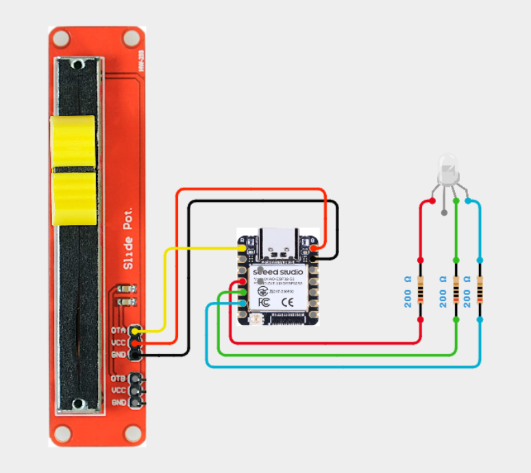

# XIAO-006-Potentiometer-Controlled-RGB-Led🎚️
Create smooth, seamless color transitions using just a sliding potentiometer! With the XIAO ESP32 S3 Sense and a common-anode RGB LED, this project lets you glide through the entire color spectrum using a single analog input — turning motion into beautiful light.

---

## 🛠️ Components Used

1. [XIAO ESP32 S3 Sense](https://robocraze.com/products/seeed-studio-xiao-esp32-s3-development-board-supports-wi-fi-bluetooth-5-0?_pos=1&_psq=XIAO+ESP32+S3&_ss=e&_v=1.0)
2. [10k Sliding Potentiometer](https://robocraze.com/products/10k-sliding-potentiometer?_pos=3&_sid=7303c64b8&_ss=r)
3. [RGB LED (Common Anode)](https://robocraze.com/products/rgb-led-common-anode-pack-of-10?_pos=7&_psq=RGB+LED&_ss=e&_v=1.0)
4. [220Ω Resistors](https://robocraze.com/products/220-ohm-resistor-pack-of-10?_pos=1&_psq=220&_ss=e&_v=1.0)
5. [Breadboard](https://robocraze.com/products/breadboard?_pos=3&_psq=BREADBOARD&_ss=e&_v=1.0)
6. [Jumper Wires](https://robocraze.com/products/f2m-jumper-wires-20cm-40pcs?_pos=1&_psq=JUMPER+WIRES&_ss=e&_v=1.0)

---

## 🎥 Project Demo

📱 [Instagram Reel](https://www.instagram.com/reel/DQ9TDR5k-10/?igsh=NWV5ZGthampiZXZz)

---

## Circuit Diagram

---
